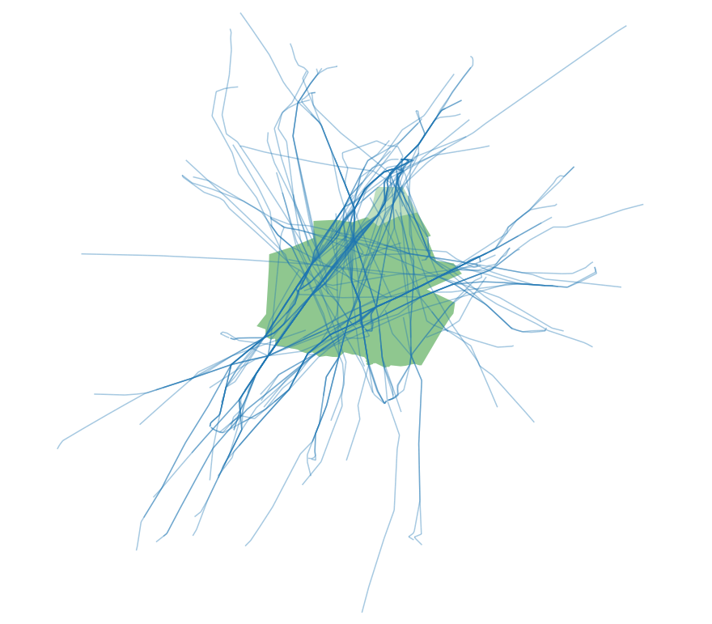
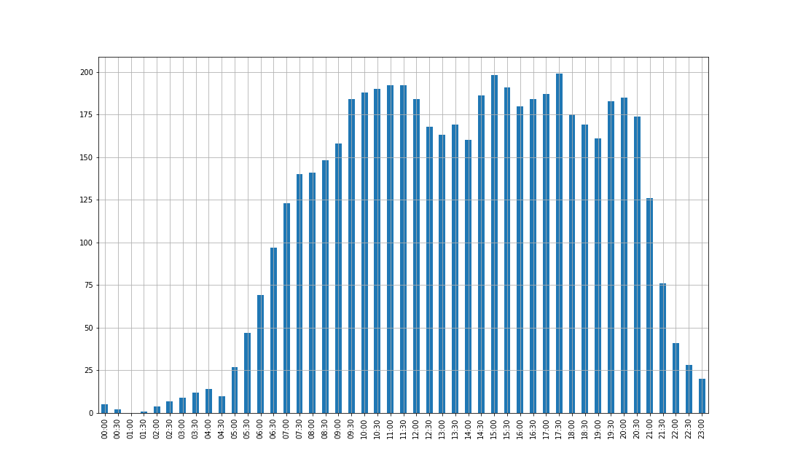

# So6 to occupancy

Determine ATC occupancy in airspace volumes from so6 traffic file

Flight data are managed with [pandas](https://pandas.pydata.org/) / [GeoPandas](http://geopandas.org/) dataframes

Trajectories are built with [movingpandas](https://pypi.org/project/movingpandas/) and intersections with airspace polygons are calculated with movingpandas functions

Example 1: portions of trajectories intersecting LFBB airspace during a given timeframe

Example 2: occupancy chart for the entire day (step 30 min, duration 60 min)

## Running the tests

Run the demo_occupancy notebook to see how to build these examples with so6trajs module

## Built With

* [pandas](https://pandas.pydata.org/) - Python Data Analysis Library

* [GeoPandas](http://geopandas.org/) - GeoPandas is an open source project which extends the datatypes used by pandas to allow spatial operations on geometric types. 

* [movingpandas](https://pypi.org/project/movingpandas/) - Implementation of Trajectory classes and functions built on top of GeoPandas

## Authors

* **Thomas Dubot** 

## License

This project is licensed under the MIT License - see the [LICENSE.md](LICENSE.md) file for details

## Acknowledgments

Thanks to https://github.com/jbedouet for GeoJSON example and ATFCM expertise